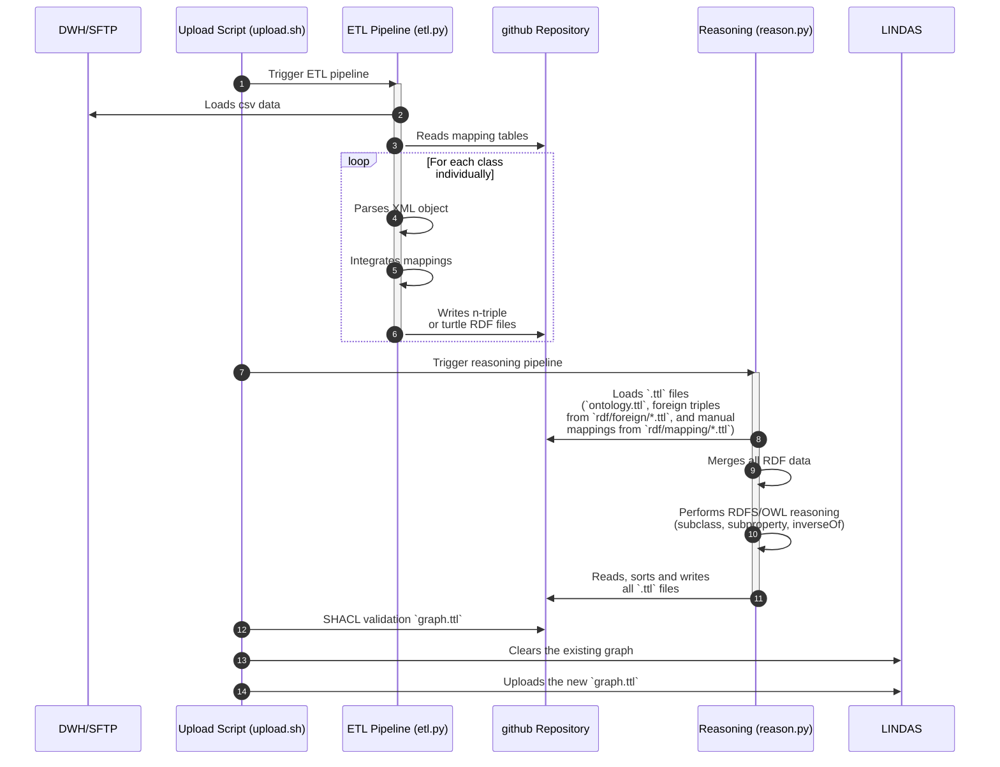

# PSMV-RDF (need a better name)
## Plant Protection Products (PSMV) as Linked Data

A Python module for converting Swiss plant protection product data from CSV format to RDF and publishing it to the LINDAS Linked Data Service.


## Features

- **CSV to RDF Conversion**: Transform Swiss plant protection product CSV data to RDF format
- **LINDAS Integration**: Direct publishing to the Swiss Federal Linked Data Service (LINDAS)
- **SHACL Validation**: Validate rdf plant protection product data 

## Roadmap

- [ ] Automated daily sync with SFTP server to get csv
- [ ] Implement ontologies
- [ ] SPARQL query templates for common queries
- [ ] Data quality reports and validation
- [ ] Pipeline for LINDAS publication

## Project Structure
```bash
psmv-rdf/
├── .github/
│   └── workflows/
│       ├── fetch_data.yml           # 1. Fetch raw CSV/source data
│       ├── run_rdf_pipeline.yml     # 2. Convert CSV → RDF
│       ├── shacl_validate.yml       # 3. Validate RDF using SHACL
│       └── lindas_publication.yml   # 4. Publish validated RDF to LINDAS
│
├── data/
│   ├── raw/
│   ├── rdf/
│   └── processed/
│ 
├── services/
│   └── run_rdf_pipeline.py             # Pipeline launcher
│
├── src/
│    ├── psmv_converter/
│        ├── __init__.py              # Marks this as a Python package
│        ├── scripts/
│            ├── fetch_data.py  
│            ├── validate_rdf.py  
│        │   └── publish_rdf.py        # Standalone script for fetching data
│        ├── converter.py             # Core module for conversion logic
│        └── utils/
│            ├── __init__.py          # Makes `utils` a subpackage
│            └── functions.py         # Helper/utility functions used across the package
│
├── shapes/                         # SHACL shapes
│   └──shapes/README.md
│
├── tests/
│   ├── test_converter.py
│   ├── test_validator.py
│   ├── test_publisher.py
│   └── data/                       # do wee need that?
│       └── sample.csv              # do wee need that?
│
├── docs/
│   ├── architecture.md
│   └── usage.md
│
├── pyproject.toml
├── .gitignore
├── README.md
└── environment.yml

```


## Pipeline



## CSV Data Format (To be defined)

The module expects Swiss plant protection product CSV files with the following structure:

### Required Columns 
- `Zulassungsnummer` - Registration number
- `Produktname` - Product name
- etc
- ...
See `examples/sample_data.csv` for a complete example.

## RDF Schema (To be defined)

The converter uses the following ontologies and vocabularies:

- **Base URI**: `https://lindas.admin.ch/ppproducts/`
- **Schema.org**: General properties (name, manufacturer)
- **Custom PPP Ontology**: Plant protection-specific terms
- **DCMI**: Metadata terms (date, identifier)

### Example Output

```turtle
@prefix ppp: <https://lindas.admin.ch/ppproducts/ontology/> .
@prefix schema: <http://schema.org/> .
@prefix dcterms: <http://purl.org/dc/terms/> .

<https://lindas.admin.ch/ppproducts/product/W-1234>
    a ppp:PlantProtectionProduct ;
    dcterms:identifier "W-1234" ;
    schema:name "Example Product Name"@de ;
    ppp:registrationNumber "W-1234" ;
    ppp:activeIngredient "Glyphosate" ;
    ppp:authorizationHolder "Example Company AG" ;
    ppp:status "active" ;
    dcterms:issued "2020-01-15"^^xsd:date .
```


## SHACL Validation (To be defined)

The module includes SHACL (Shapes Constraint Language) validation to ensure data quality before publishing to LINDAS.

### Running SHACL Validation

```python
from psmv-converter import PPPConverter, SHACLValidator

# Convert CSV to RDF
converter = PPPConverter()
converter.load_csv('products.csv')
rdf_graph = converter.to_rdf()

# Validate against SHACL shapes
validator = SHACLValidator()
validator.load_shapes('shapes/ppp_shapes.ttl')

# Run validation
conforms, results_graph, results_text = validator.validate(rdf_graph)

if conforms:
    print("✓ Data is valid!")
else:
    print("✗ Validation errors found:")
    print(results_text)
```

### SHACL Shapes (To be defined)

The module includes predefined SHACL shapes for plant protection products:

```turtle
@prefix sh: <http://www.w3.org/ns/shacl#> .
@prefix ppp: <https://lindas.admin.ch/ppproducts/ontology/> .
@prefix schema: <http://schema.org/> .
@prefix xsd: <http://www.w3.org/2001/XMLSchema#> .

# Shape for Plant Protection Product
ppp:PlantProtectionProductShape
    a sh:NodeShape ;
    sh:targetClass ppp:PlantProtectionProduct ;
    sh:property [
        sh:path dcterms:identifier ;
        sh:minCount 1 ;
        sh:maxCount 1 ;
        sh:datatype xsd:string ;
        sh:pattern "^W-[0-9]{4,6}$" ;
        sh:message "Registration number must match pattern W-XXXX"@en ;
    ] ;
    sh:property [
        sh:path schema:name ;
        sh:minCount 1 ;
        sh:datatype xsd:string ;
        sh:minLength 1 ;
        sh:message "Product name is required"@en ;
    ] ;
    sh:property [
        sh:path ppp:authorizationHolder ;
        sh:minCount 1 ;
        sh:datatype xsd:string ;
        sh:message "Authorization holder is required"@en ;
    ] ;
    sh:property [
        sh:path ppp:status ;
        sh:maxCount 1 ;
        sh:in ("active" "expired" "suspended" "withdrawn") ;
        sh:message "Status must be one of: active, expired, suspended, withdrawn"@en ;
    ] ;
    sh:property [
        sh:path dcterms:issued ;
        sh:maxCount 1 ;
        sh:datatype xsd:date ;
    ] .
```


### Shape Files Location

SHACL shape files are located in the `shapes/` directory:
- `shapes/ppp_shapes.ttl` - Core plant protection product shapes
- `shapes/ingredient_shapes.ttl` - Active ingredient validation
- `shapes/authorization_shapes.ttl` - Authorization and regulatory shapes

## Documentation (To be defined)

Full documentation is available at io site (To be done)

### Examples (To be defined)

Check the `examples/` directory for usage examples:

- `basic_conversion.py` - Simple CSV to RDF conversion
- `lindas_publishing.py` - Publishing to LINDAS
- `custom_mappings.py` - Using custom field mappings
- `data_validation.py` - Validating CSV data


## Dependencies (To be defined)

- `rdflib` - RDF library for Python
- `pandas` - CSV data processing
- `requests` - HTTP requests for LINDAS API
- `pyyaml` - Configuration file parsing
- `pyshacl` - SHACL validation

## Acknowledgments 

- Built with [rdflib](https://github.com/RDFLib/rdflib)
- Integrates with [LINDAS](https://lindas.admin.ch/) - Swiss Federal Linked Data Service
- Orignial ontology and pipeline by Damian Oswald with [plant protection pipeline](https://github.com/blw-ofag-ufag/plant-protection)


