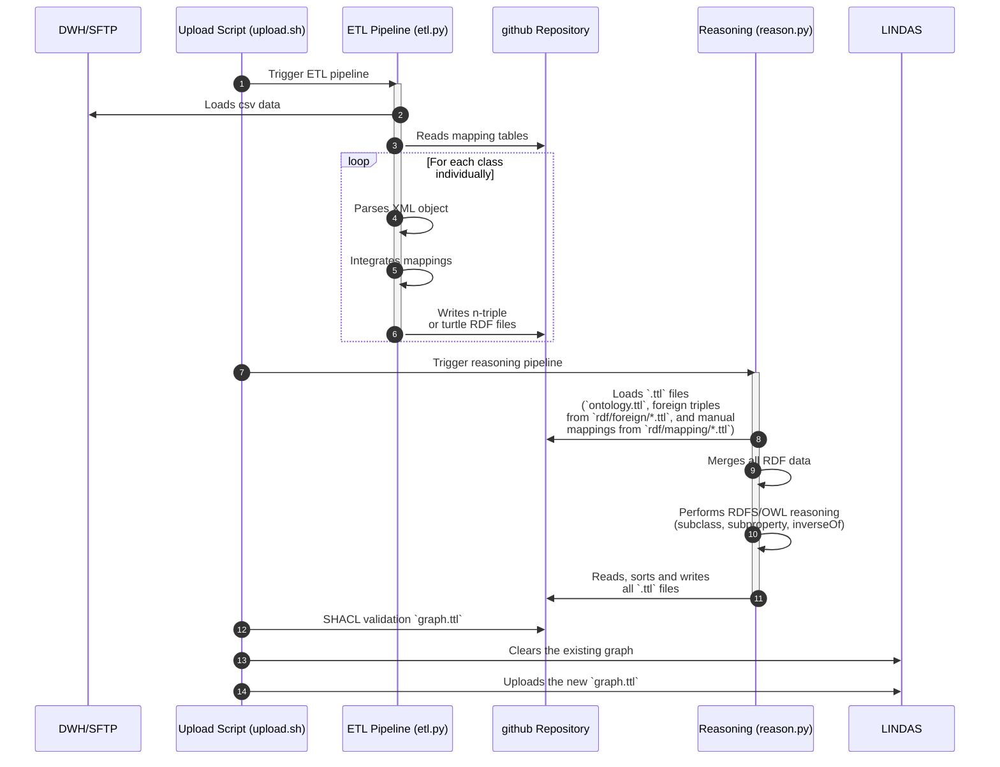

# PSMV-RDF (need a better name) 🚧 Work in Progress
> This repository is under active development. Features, documentation, and structure will change frequently.

## Plant Protection Products (PSMV) as Linked Data

A Python module for converting Swiss plant protection product data from CSV format to RDF and publishing it to the LINDAS Linked Data Service.

## Setup

``` bash
conda env create -f environment.yml
conda activate psmv-rdf
```

## Features

- **CSV to RDF Conversion**: Transform Swiss plant protection product CSV data to RDF format
- **LINDAS Integration**: Direct publishing to the Swiss Federal Linked Data Service (LINDAS)
- **SHACL Validation**: Validate rdf plant protection product data 

## Roadmap

- [ ] Automated daily sync with SFTP server to get csv
- [ ] Implement ontologies
- [ ] SPARQL query templates for common queries
- [ ] Data quality reports and validation
- [ ] Pipeline for LINDAS publication

## Project Structure
```bash
psmv-rdf/
├── .github/
│   └── workflows/
│       ├── fetch_data.yml           # 1. Fetch raw CSV/source data
│       ├── run_rdf_pipeline.yml     # 2. Convert CSV → RDF
│       ├── shacl_validate.yml       # 3. Validate RDF using SHACL
│       └── lindas_publication.yml   # 4. Publish validated RDF to LINDAS
│
├── data/
│   ├── raw/
│   ├── mapping/
│   └── processed/
│ 
├── services/
│   └── pipeline.py       
│
├── src/
│    ├── sparql
│    ├── python/
│        ├── __init__.py
│        ├── fetch_data.py         
│        ├── validate_rdf.py  
│        └── publish_rdf.py        
│
├── rdf/
│   ├── ontology/
│   └── shapes                      
│
├── tests/
│
├── docs/
│
├── .gitignore
├── README.md
└── environment.yml

```


## Pipeline

```mermaid
sequenceDiagram

    autonumber

    participant FSVO as DWH/SFTP
    participant UploadScript as Upload Script (upload.sh)
    participant ETL_Pipeline as ETL Pipeline (etl.py)
    participant Repo as github Repository
    participant ReasoningScript as Reasoning (reason.py)
    participant LINDAS as LINDAS

    UploadScript->>ETL_Pipeline: Trigger ETL pipeline

    activate ETL_Pipeline
        ETL_Pipeline->>FSVO: Loads csv data
        ETL_Pipeline->>Repo: Reads mapping tables
        loop For each class individually
            ETL_Pipeline->>ETL_Pipeline: Parses XML object
            ETL_Pipeline->>ETL_Pipeline: Integrates mappings
            ETL_Pipeline->>Repo: Writes n-triple<br>or turtle RDF files
        end
    deactivate ETL_Pipeline

    UploadScript->>ReasoningScript: Trigger reasoning pipeline
    activate ReasoningScript
        ReasoningScript->>Repo: Loads `.ttl` files<br>(`ontology.ttl`, foreign triples<br>from `rdf/foreign/*.ttl`, and manual<br>mappings from `rdf/mapping/*.ttl`)
        ReasoningScript->>ReasoningScript: Merges all RDF data
        ReasoningScript->>ReasoningScript: Performs RDFS/OWL reasoning<br>(subclass, subproperty, inverseOf)
        ReasoningScript->>Repo: Reads, sorts and writes<br>all `.ttl` files
    deactivate ReasoningScript

    UploadScript->>Repo: SHACL validation `graph.ttl`
    UploadScript->>LINDAS: Clears the existing graph
    UploadScript->>LINDAS: Uploads the new `graph.ttl`
```


## CSV Data Format (To be defined)

The module expects Swiss plant protection product CSV files with the following structure:

### Required Columns 
- `Zulassungsnummer` - Registration number
- `Produktname` - Product name
- etc
- ...
See `examples/sample_data.csv` for a complete example.

## RDF Schema (To be defined)

The converter uses the following ontologies and vocabularies:

- **Base URI**: `https://lindas.admin.ch/ppproducts/`
- **Schema.org**: General properties (name, manufacturer)
- **Custom PPP Ontology**: Plant protection-specific terms
- **DCMI**: Metadata terms (date, identifier)

### Example Output (to be defined)

```turtle
@prefix schema: <http://schema.org/> .
@prefix dcterms: <http://purl.org/dc/terms/> .

```


## SHACL Validation (To be defined)

The module includes SHACL (Shapes Constraint Language) validation to ensure data quality before publishing to LINDAS.

### Running SHACL Validation

```python
# Add example 
```

### SHACL Shapes (To be defined)

The module includes predefined SHACL shapes for plant protection products:

```turtle
@prefix sh: <http://www.w3.org/ns/shacl#> .

```


### Shape Files Location

SHACL shape files are located in the `shapes/` directory:
- `shapes/ppp_shapes.ttl` - Core plant protection product shapes
- `shapes/ingredient_shapes.ttl` - Active ingredient validation
- `shapes/authorization_shapes.ttl` - Authorization and regulatory shapes

## Documentation (To be defined)

Full documentation is available at io site (To be done)

**SALE_PERMISSION**: Permission to market a plant protection product under a different name on the basis of an existing (regular or simplified) authorisation. <br>
The marketing authorisation is granted upon request and requires the written consent of the holder of the basic authorisation. <br>
It may apply to all or individual authorised indications and is linked to the validity of the basic authorisation. (PSMV Art 66) <br>

**PARALLEL_IMPORT**: Placing on the market of a PPP with a foreign authorisation holder (EU) based on an equivalent product that is authorised in Switzerland. <br>
It applies to all authorised indications of the reference product and is linked to the validity of the reference product (PSMV Art 47 Abs1) <br>
 
**REGULAR**: PPP with Swiss authorisation <br>

## Ontology documentation

- All ontology documentation files are written to `rdf/ontology`.
- You may inspect a visual representation of the ontology used here: <https://service.tib.eu/webvowl/#iri=https://raw.githubusercontent.com/BLV-OSAV-USAV/PSMV-RDF/refs/heads/main/rdf/ontology/core.ttl>

## Data model

Are more restricted data model is written in SHACL and [can be inspected here](https://shacl-play.sparna.fr/play/doc?format=html&url=https%3A%2F%2Fraw.githubusercontent.com%2FBLV-OSAV-USAV%2FPSMV-RDF%2Frefs%2Fheads%2Fmain%2Frdf%2Fshapes%2Fdata_shape.ttl&includeDiagram=false&sectionDiagram=false)

### Examples (To be defined)

Check the `examples/` directory for usage examples:

- `basic_conversion.py` - Simple CSV to RDF conversion
- `lindas_publishing.py` - Publishing to LINDAS
- `custom_mappings.py` - Using custom field mappings
- `data_validation.py` - Validating CSV data


## Dependencies (To be defined)

- `rdflib` - RDF library for Python
- `pandas` - CSV data processing
- `requests` - HTTP requests for LINDAS API
- `pyyaml` - Configuration file parsing
- `pyshacl` - SHACL validation

## Acknowledgments 

- Built with [rdflib](https://github.com/RDFLib/rdflib)
- Integrates with [LINDAS](https://lindas.admin.ch/) - Swiss Federal Linked Data Service
- Orignial ontology and pipeline by Damian Oswald with [plant protection pipeline](https://github.com/blw-ofag-ufag/plant-protection)


