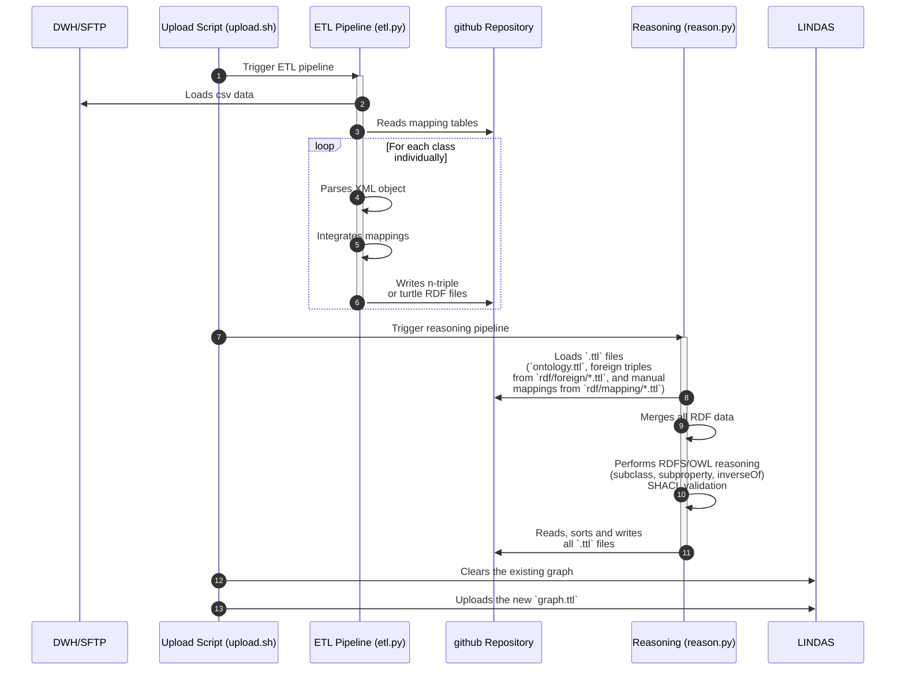

```mermaid
sequenceDiagram

    autonumber

    participant FSVO as DWH/SFTP
    participant UploadScript as Upload Script (upload.sh)
    participant ETL_Pipeline as ETL Pipeline (etl.py)
    participant Repo as github Repository
    participant ReasoningScript as Reasoning (reason.py)
    participant LINDAS as LINDAS

    UploadScript->>ETL_Pipeline: Trigger ETL pipeline

    activate ETL_Pipeline
        ETL_Pipeline->>FSVO: Loads csv data
        ETL_Pipeline->>Repo: Reads mapping tables
        loop For each class individually
            ETL_Pipeline->>ETL_Pipeline: Parses XML object
            ETL_Pipeline->>ETL_Pipeline: Integrates mappings
            ETL_Pipeline->>Repo: Writes n-triple<br>or turtle RDF files
        end
    deactivate ETL_Pipeline

    UploadScript->>ReasoningScript: Trigger reasoning pipeline
    activate ReasoningScript
        ReasoningScript->>Repo: Loads `.ttl` files<br>(`ontology.ttl`, foreign triples<br>from `rdf/foreign/*.ttl`, and manual<br>mappings from `rdf/mapping/*.ttl`)
        ReasoningScript->>ReasoningScript: Merges all RDF data
        ReasoningScript->>ReasoningScript: Performs RDFS/OWL reasoning<br>(subclass, subproperty, inverseOf)<br>SHACL validation
        ReasoningScript->>Repo: Reads, sorts and writes<br>all `.ttl` files
    deactivate ReasoningScript

    UploadScript->>LINDAS: Clears the existing graph
    UploadScript->>LINDAS: Uploads the new `graph.ttl`
```
