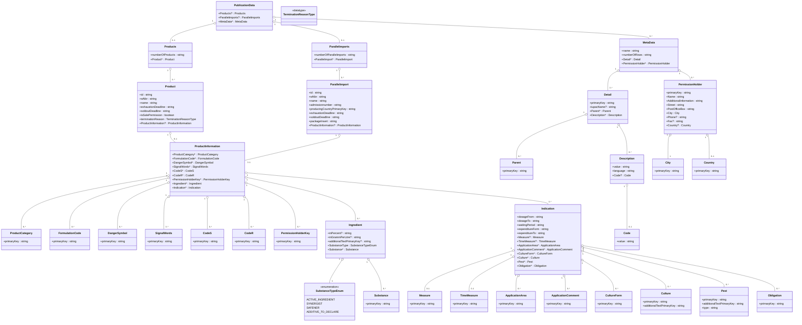

```mermaid
classDiagram
direction TB

class PublicationData {
  +Products? : Products
  +Parallelimports? : Parallelimports
  +MetaData* : MetaData
}

class Products {
  +numberOfProducts : string
  +Product* : Product
}

class Product {
  +id : string
  +wNbr : string
  +name : string
  +exhaustionDeadline : string
  +soldoutDeadline : string
  +isSalePermission : boolean
  +terminationReason : TerminationReasonType
  +ProductInformation? : ProductInformation
}

class Parallelimports {
  +numberOfParallelimports : string
  +Parallelimport* : Parallelimport
}

class Parallelimport {
  +id : string
  +wNbr : string
  +name : string
  +admissionnumber : string
  +producingCountryPrimaryKey : string
  +exhaustionDeadline : string
  +soldoutDeadline : string
  +packageInsert : string
  +ProductInformation? : ProductInformation
}

class MetaData {
  +name : string
  +numberOfRows : string
  +Detail* : Detail
  +PermissionHolder* : PermissionHolder
}

class Detail {
  +primaryKey : string
  +iupacName? : string
  +Parent* : Parent
  +Description* : Description
}

class Parent {
  +primaryKey : string
}

class Description {
  +value : string
  +language : string
  +Code? : Code
}

class Code {
  +value : string
}

class ProductInformation {
  +ProductCategory* : ProductCategory
  +FormulationCode* : FormulationCode
  +DangerSymbol* : DangerSymbol
  +SignalWords* : SignalWords
  +CodeS* : CodeS
  +CodeR* : CodeR
  +PermissionHolderKey* : PermissionHolderKey
  +Ingredient* : Ingredient
  +Indication* : Indication
}

class Indication {
  +dosageFrom : string
  +dosageTo : string
  +waitingPeriod : string
  +expenditureForm : string
  +expenditureTo : string
  +Measure? : Measure
  +TimeMeasure? : TimeMeasure
  +ApplicationArea* : ApplicationArea
  +ApplicationComment* : ApplicationComment
  +CultureForm* : CultureForm
  +Culture* : Culture
  +Pest* : Pest
  +Obligation* : Obligation
}

class Measure { +primaryKey : string }
class TimeMeasure { +primaryKey : string }
class ApplicationArea { +primaryKey : string }
class ApplicationComment { +primaryKey : string }

class CultureForm { +primaryKey : string }
class Culture {
  +primaryKey : string
  +additionalTextPrimaryKey : string
}
class Pest {
  +primaryKey : string
  +additionalTextPrimaryKey : string
  +type : string
}
class Obligation { +primaryKey : string }

class Ingredient {
  +inPercent? : string
  +inGrammPerLitre? : string
  +additionalTextPrimaryKey? : string
  +SubstanceType : SubstanceTypeEnum
  +Substance* : Substance
}

class Substance {
  +primaryKey : string
}

class PermissionHolder {
  +primaryKey : string
  +Name : string
  +AdditionalInformation : string
  +Street : string
  +PostOfficeBox : string
  +City : City
  +Phone? : string
  +Fax? : string
  +Country? : Country
}

class City { +primaryKey : string }
class Country { +primaryKey : string }

class ProductCategory { +primaryKey : string }
class FormulationCode { +primaryKey : string }
class DangerSymbol { +primaryKey : string }
class SignalWords { +primaryKey : string }
class CodeS { +primaryKey : string }
class CodeR { +primaryKey : string }
class PermissionHolderKey { +primaryKey : string }

class SubstanceTypeEnum {
  <<enumeration>>
  ACTIVE_INGREDIENT
  SYNERGIST
  SAFENER
  ADDITIVE_TO_DECLARE
}

class TerminationReasonType {
  <<datatype>>
}

PublicationData "1" o-- "0..1" Products
PublicationData "1" o-- "0..1" Parallelimports
PublicationData "1" o-- "0..*" MetaData

Products "1" o-- "0..*" Product
Parallelimports "1" o-- "0..*" Parallelimport

Product "1" o-- "0..1" ProductInformation
Parallelimport "1" o-- "0..1" ProductInformation

MetaData "1" o-- "0..*" Detail
MetaData "1" o-- "0..*" PermissionHolder

Detail "1" o-- "0..*" Parent
Detail "1" o-- "0..*" Description
Description "1" o-- "0..1" Code

ProductInformation "1" o-- "0..*" ProductCategory
ProductInformation "1" o-- "0..*" FormulationCode
ProductInformation "1" o-- "0..*" DangerSymbol
ProductInformation "1" o-- "0..*" SignalWords
ProductInformation "1" o-- "0..*" CodeS
ProductInformation "1" o-- "0..*" CodeR
ProductInformation "1" o-- "0..*" PermissionHolderKey
ProductInformation "1" o-- "0..*" Ingredient
ProductInformation "1" o-- "0..*" Indication

Indication "1" o-- "0..1" Measure
Indication "1" o-- "0..1" TimeMeasure
Indication "1" o-- "0..*" ApplicationArea
Indication "1" o-- "0..*" ApplicationComment
Indication "1" o-- "0..*" CultureForm
Indication "1" o-- "0..*" Culture
Indication "1" o-- "0..*" Pest
Indication "1" o-- "0..*" Obligation

Ingredient "1" o-- "1" SubstanceTypeEnum
Ingredient "1" o-- "0..*" Substance

PermissionHolder "1" o-- "1" City
PermissionHolder "1" o-- "0..1" Country
```