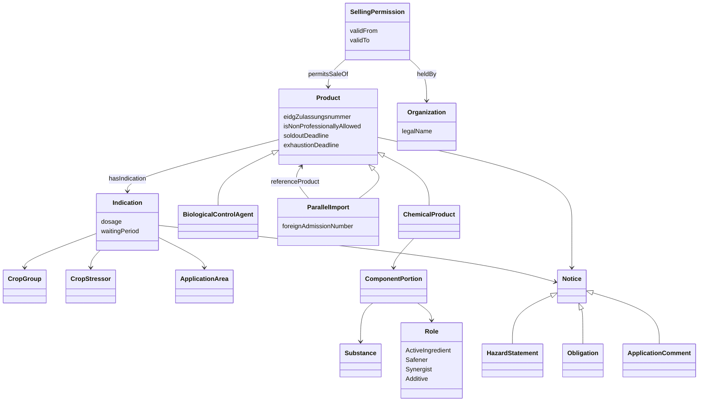
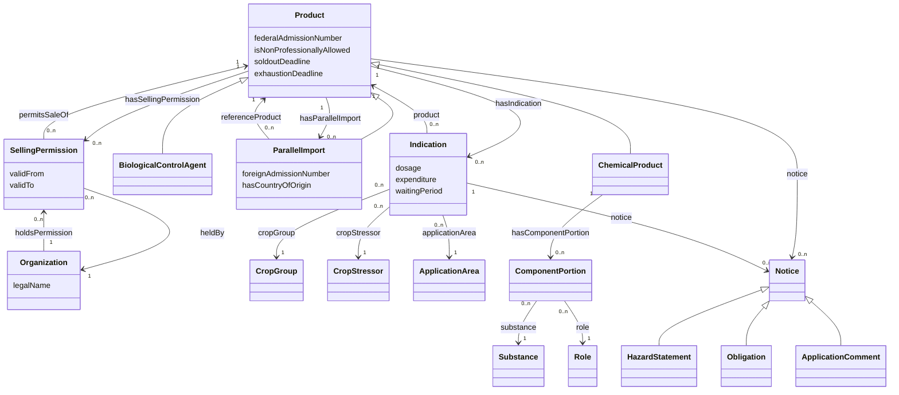

```mermaid
classDiagram

class Product {
  eidgZulassungsnummer
  isNonProfessionallyAllowed
  soldoutDeadline
  exhaustionDeadline
}

class ChemicalProduct
class BiologicalControlAgent

Product <|-- ChemicalProduct
Product <|-- BiologicalControlAgent

class ParallelImport {
  foreignAdmissionNumber
}

Product <|-- ParallelImport
ParallelImport --> Product : referenceProduct

class SellingPermission {
  validFrom
  validTo
}

SellingPermission --> Product : permitsSaleOf
SellingPermission --> Organization : heldBy

class Organization {
  legalName
}

class Indication {
  dosage
  waitingPeriod
}

Product --> Indication : hasIndication

Indication --> CropGroup
Indication --> CropStressor
Indication --> ApplicationArea

class CropGroup
class CropStressor
class ApplicationArea

class Substance
class ComponentPortion

ChemicalProduct --> ComponentPortion
ComponentPortion --> Substance
ComponentPortion --> Role

class Role {
  ActiveIngredient
  Safener
  Synergist
  Additive
}

class Notice
class HazardStatement
class Obligation
class ApplicationComment

Product --> Notice
Indication --> Notice

Notice <|-- HazardStatement
Notice <|-- Obligation
Notice <|-- ApplicationComment

```

```mermaid
classDiagram

%% -----------------------------
%% KLASSEN (Core)
%% -----------------------------
class Product {
  federalAdmissionNumber
  isNonProfessionallyAllowed
  soldoutDeadline
  exhaustionDeadline
}

class ChemicalProduct
class BiologicalControlAgent
class ParallelImport {
  foreignAdmissionNumber
  hasCountryOfOrigin
}

Product <|-- ChemicalProduct
Product <|-- BiologicalControlAgent
Product <|-- ParallelImport

class SellingPermission {
  validFrom
  validTo
}

class Organization {
  legalName
}

class Indication {
  dosage
  expenditure
  waitingPeriod
}

class CropGroup
class CropStressor
class ApplicationArea

class Notice
class HazardStatement
class Obligation
class ApplicationComment

Notice <|-- HazardStatement
Notice <|-- Obligation
Notice <|-- ApplicationComment

class Substance
class ComponentPortion
class Role

%% -----------------------------
%% BEZIEHUNGEN MIT KARDINALITAETEN
%% Syntax: A "multA" --> "multB" B : label
%% -----------------------------

%% Produkt - Indikation
Product "1" --> "0..n" Indication : hasIndication
Indication "0..n" --> "1" Product : product

%% Indikation - Kontext
Indication "0..n" --> "1" CropGroup : cropGroup
Indication "0..n" --> "1" CropStressor : cropStressor
Indication "0..n" --> "1" ApplicationArea : applicationArea

%% Verkaufserlaubnis
Organization "1" --> "0..n" SellingPermission : holdsPermission
SellingPermission "0..n" --> "1" Organization : heldBy

Product "1" --> "0..n" SellingPermission : hasSellingPermission
SellingPermission "0..n" --> "1" Product : permitsSaleOf

%% Parallelimport - Referenzprodukt
ParallelImport "0..n" --> "1" Product : referenceProduct
Product "1" --> "0..n" ParallelImport : hasParallelImport

%% Hinweise (generisch)
Product "1" --> "0..n" Notice : notice
Indication "1" --> "0..n" Notice : notice

%% Chemische Zusammensetzung (nur ChemicalProduct)
ChemicalProduct "1" --> "0..n" ComponentPortion : hasComponentPortion
ComponentPortion "0..n" --> "1" Substance : substance
ComponentPortion "0..n" --> "1" Role : role

```
